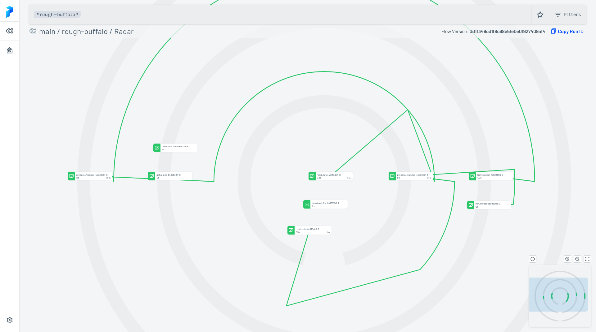

# Homework for week 3

###  DataTalksClub / mlops-zoomcamp
### Ferdinand Kleinschroth
### 13.6.2022

## Question 1

`train_model` needs `.result()` to be called.

## Question 2

The validation MSE is 11.637.
 

 ## Question 3

 The size of the `DictVectorizer` if train with `date = '2021-08-15'` is 13,000 bytes.


 ## Question 4

 The following Cron expression evaluates to 9 AM every 15th of the month:

 `0 9 15 * *`


 ## Question 5

 After removing the filters for the scheduled flow, the number of upcoming runs was 4.


 ## Question 6

The help flag reveals the following:

```console
❯ prefect work-queue --help                                      
Usage: prefect work-queue [OPTIONS] COMMAND [ARGS]...

  Commands for work queue CRUD.

Options:
  --help  Show this message and exit.

Commands:
  clear-concurrency-limit  Clear any concurrency limits from a work queue.
  create                   Create a work queue.
  delete                   Delete a work queue by ID.
  inspect                  Inspect a work queue by ID.
  ls                       View all work queues.
  pause                    Pause a work queue.
  preview                  Preview a work queue.
  resume                   Resume a paused work queue.
  set-concurrency-limit    Set a concurrency limit on a work queue.

```
Thus the command `prefect work-queue ls` shows all available work queues:

```console
❯ prefect work-queue ls                                          
                                     Work Queues                                     
┏━━━━━━━━━━━━━━━━━━━━━━━━━━━━━━━━━━━━━━┳━━━━━━━━━━━━━━━━━━━━━━━━┳━━━━━━━━━━━━━━━━━━━┓
┃                                   ID ┃ Name                   ┃ Concurrency Limit ┃
┡━━━━━━━━━━━━━━━━━━━━━━━━━━━━━━━━━━━━━━╇━━━━━━━━━━━━━━━━━━━━━━━━╇━━━━━━━━━━━━━━━━━━━┩
│ fbe597d0-0526-4002-950d-3b6579f48184 │ fhv-training-mid-month │ None              │
│ b8b6d653-a549-48cb-bcec-ebb08cf6c618 │ global                 │ None              │
└──────────────────────────────────────┴────────────────────────┴───────────────────┘
                             (**) denotes a paused queue        
```


A screenshot of Prefect's radar:
